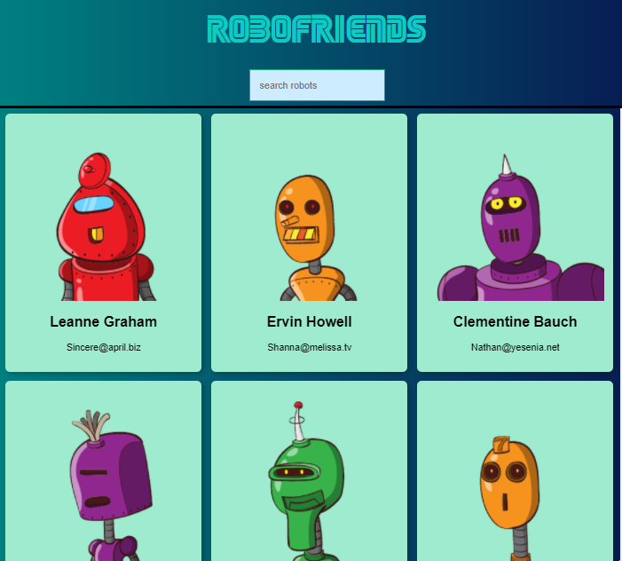

# robotHash
Proyecto de prueba con React

To run the project:

1. Clonar el repositorio
2. Run `npm install`
3. Run `npm start`

/////////////////////////////////////////////////////////////////////////

¿Cómo lo veo?
1. En la columna derecha en la sección enviroments, click en <strong>github-pages</strong>
2. Click en <strong>View deployment</strong>

=========================================================================

<strong>Screenshoot del sitio</strong>

